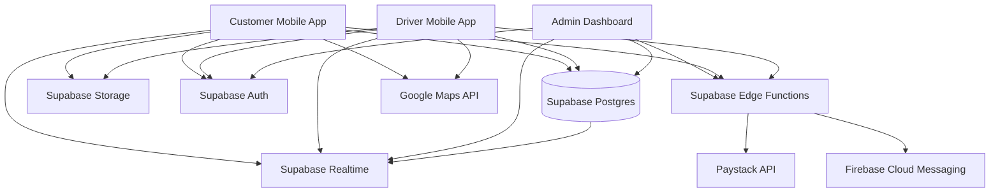

# Ghana Logistics MVP Architecture

## 1) System Context

The platform is a three-sided marketplace for Accra logistics:

- **Customer App (Expo React Native)**: book trucks, track trips, escrow payments.
- **Driver App (Expo React Native)**: receive jobs, navigate, complete deliveries, payout.
- **Admin Dashboard (Next.js)**: verification, dispute handling, live operations.

## 2) High-Level Architecture

## 3) Domain Boundaries

1. **Identity & Access**
   - Supabase Auth for session lifecycle.
   - Role-based profile (`customer`, `driver`, `admin`).
   - RLS policies enforce data boundaries.

2. **Fleet & Driver Onboarding**
   - Driver verification (Ghana Card, license, docs).
   - Vehicle/truck metadata: photos, dimensions, capacity.
   - Online/offline state + municipality assignment.

3. **Dispatch & Booking**
   - Municipality-aware discovery for nearby drivers.
   - Driver proximity index (`driver_locations` with geospatial point).
   - Booking state machine from `pending` to `completed`.

4. **Escrow Payments**
   - Customer pays via Paystack.
   - Payment held in escrow until delivery PIN confirmation or auto-release.
   - Commission and cancellation fees handled by ledger entries.

5. **Payouts**
   - Driver net payout initiated on completion.
   - Payout records include Paystack transfer references.
   - Retry and failed payout states tracked.

6. **Trust & Support**
   - Ratings/reviews both directions.
   - Dispute workflow with admin resolution.
   - Full auditability through transaction ledgers and booking events.

## 4) Realtime Model

- Drivers broadcast location updates every few seconds to `driver_locations`.
- Customer and admin subscribe to location streams for active bookings.
- Booking status changes are emitted through Supabase Realtime subscriptions.
- Presence (online/offline) is represented by `drivers.is_online` and heartbeat timestamp.

## 5) Escrow Flow

1. Customer creates booking and receives amount quote.
2. Customer pays via Paystack checkout (`payments.status=processing`).
3. Paystack webhook confirms payment (`payments.status=held_in_escrow`).
4. Driver sees booking as `payment_secured`.
5. Driver completes trip.
6. Customer confirms delivery with PIN.
7. `release-escrow` edge function:
   - deducts platform commission
   - posts ledger transactions
   - creates payout request
8. Driver receives MoMo payout.
9. Auto-release timer runs when confirmation is delayed.

## 6) Security Baseline

- Row-level security on all user-owned tables.
- Signed webhook verification for Paystack callbacks.
- Delivery PIN stored hashed (`pgcrypto` digest), never plaintext.
- Storage buckets separated by document type and role.
- Admin actions audited in `booking_events` and `transactions`.

## 7) Scalability Notes

- Use Postgres indexes on status, municipality, and geospatial columns.
- Keep booking reads denormalized through selective views for mobile clients.
- Move heavy analytics queries to materialized views or BI replica as usage grows.
- Add queue worker (edge background jobs) for payout retries and notification fanout.
